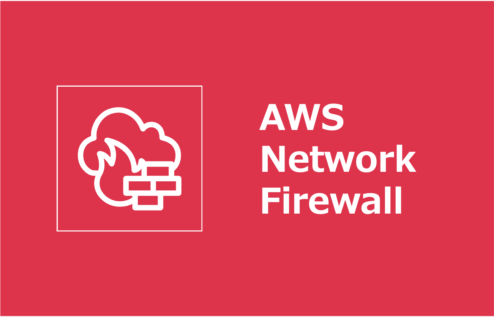
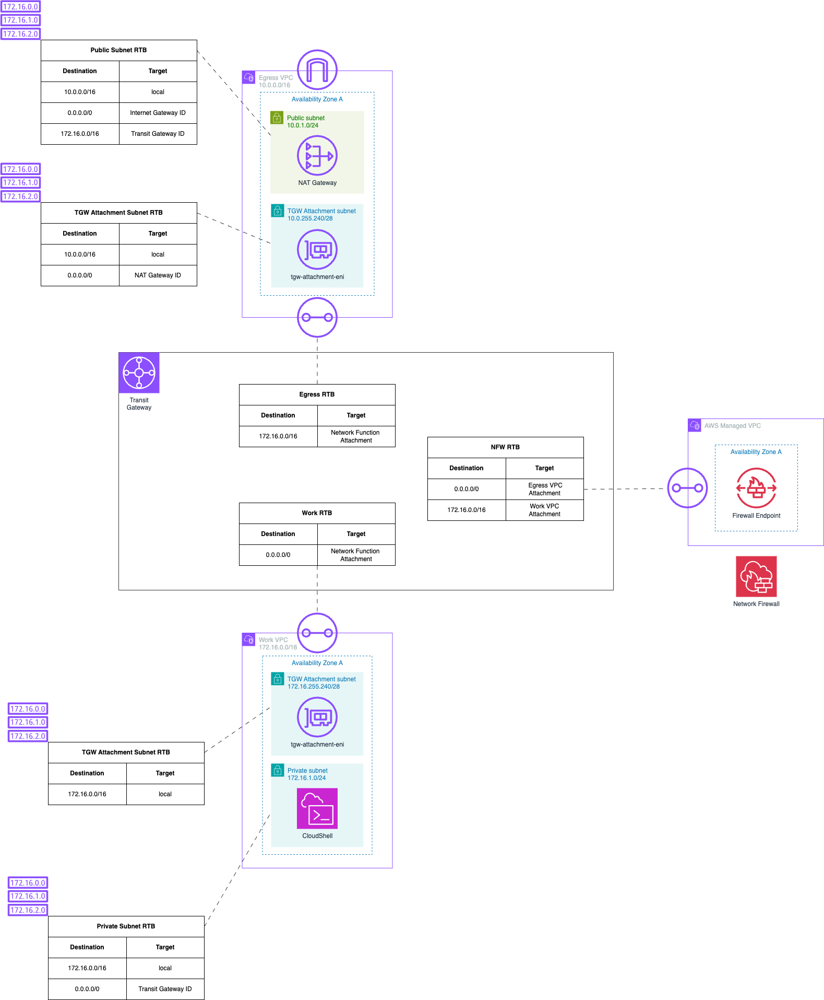

=====================================================================
AWS Network Firewall が Transit Gateway にネイティブ統合されたので試してみる
=====================================================================
* `詳細 <>`_

=====================================================================
構成図
=====================================================================

=====================================================================
デプロイ - CDK -
=====================================================================

作業環境 - ローカル -
=====================================================================
* macOS Tahoe ( v26.2 )
* Visual Studio Code 1.108.2
* aws-cli/2.32.10 Python/3.13.9 Darwin/25.2.0 exe/arm64
* pnpm 10.30.1
* nvm 0.40.4
* node v24.13.1
* typescript Version 5.9.3
* aws-cdk 2.1106.0 (build 114788d)

フォルダ構成
=====================================================================
* `こちら <./folder.md>`_ を参照

前提条件
=====================================================================
* *AdministratorAccess* がアタッチされているIAMユーザーを作成していること
* 実作業は *app* フォルダ配下で実施すること
* 以下コマンドを実行し、*admin* プロファイルを作成していること (デフォルトリージョンは *ap-northeast-1* )

.. code-block:: zsh
    
    aws login --profile admin

事前作業(1)
=====================================================================
1. 各種モジュールインストール
---------------------------------------------------------------------
* `GitHub <https://github.com/tyskJ/common-environment-setup>`_ を参照

事前作業(2)
=====================================================================
1. 依存関係のインストール
---------------------------------------------------------------------
.. code-block:: zsh
    
    pnpm install

2. CDKデプロイメント事前準備
---------------------------------------------------------------------
.. code-block:: zsh

    cdk bootstrap \
    --toolkit-stack-name CustomCDKToolkit \
    --bootstrap-bucket-name cdk-bootstrap-bucket \
    --tags CdkToolKit=true \
    --profile admin

.. note::

    * オプションは任意のためなくても問題ないです

.. note::

    * バケット名は、全世界で一意である必要があります
    * 作成に失敗した場合は、バケット名を修正してください

実作業 - ローカル -
=====================================================================
1. デプロイ
---------------------------------------------------------------------
.. code-block:: zsh

    cdk deploy --profile admin

後片付け - ローカル -
=====================================================================
1. 環境削除
---------------------------------------------------------------------
.. code-block:: zsh

    cdk destroy --profile admin

参考資料
=====================================================================
リファレンス
---------------------------------------------------------------------

ブログ
---------------------------------------------------------------------